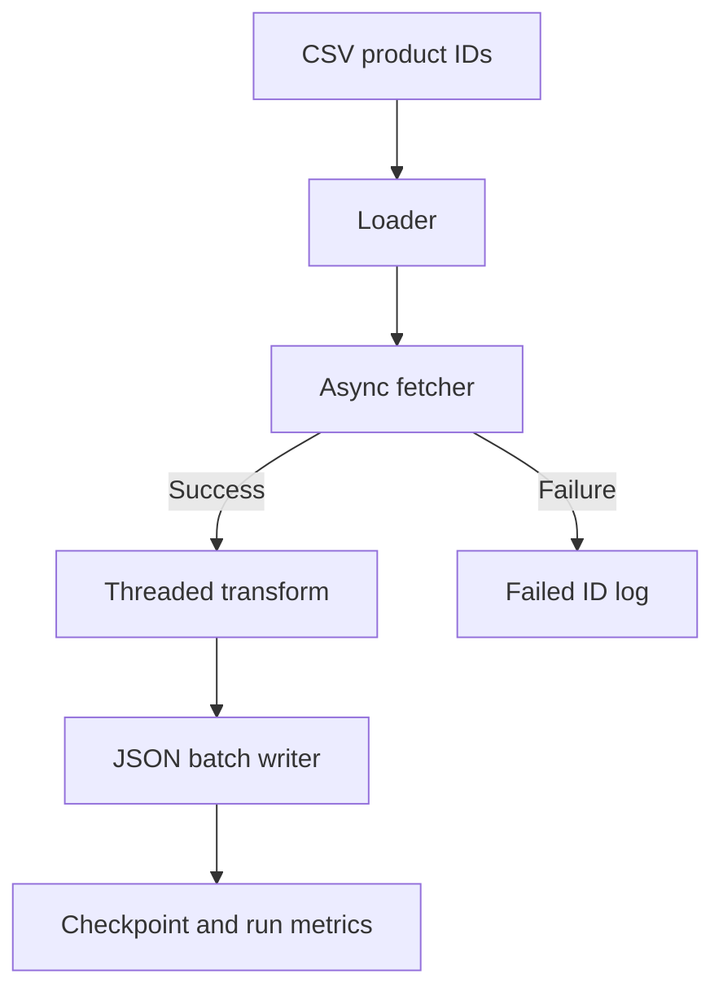

<h1 align="center">Tiki Product Pipeline</h1>
<p align="center">
  An asynchronous Python pipeline for collecting and normalizing Tiki product data.
</p>
<p align="center">
  
  
  
  
</p>
<p align="center">
  <a href="#overview">Overview</a> ·
  <a href="#quick-start">Quick Start</a> ·
  <a href="#pipeline-design">Pipeline Design</a> ·
  <a href="#output-and-recovery">Output &amp; Recovery</a> ·
  <a href="#known-limitations">Known Limitations</a>
</p>

---

## Overview
This project reads product IDs from a CSV file, requests product details from the endpoint configured in `config.py`, cleans descriptions, and writes one JSON file per batch. It records failed fetches separately and stores the most recently completed batch so a later run can continue.
> **Before running:** The configured input file, `products-0-200000.csv`, is **not included** in the supplied repository archive. Provide your own product IDs and follow the CSV format below. The archive already contains a checkpoint at batch 201; read [Resume, reset, and retries](#resume-reset-and-retries) before using a new input file.

## Features
| | Capability | Implementation |
|:---:|---|---|
| ⚡ | Concurrent requests | `asyncio` and `aiohttp`, with a connection limit |
| 🧹 | Product normalization | Selected fields and plain text descriptions via Beautiful Soup |
| 📦 | Batch exports | JSON array in `output/products_<batch>.json` |
| ♻️ | Resume | Last completed batch in `checkpoints/progress.json` |
| 🧾 | Failed fetch log | Product ID, batch, error, and timestamp in `errors/` |
| 📊 | Run summary | Successful record count and elapsed time for the current process |
| 🚨 | Crash alert | Local text file written to `gdrive_alert/` |

---

## Quick Start
### 1. Prepare Python and install dependencies
Use Python 3.10 or later. From the repository root:
```sh
python -m venv .venv
```

Activate the environment for your shell:
```sh
# macOS / Linux
source .venv/bin/activate

# Windows PowerShell
.venv\Scripts\Activate.ps1
```

```sh
python -m pip install -r requirements.txt
```

The archive contains a Windows `venv/`; create a fresh local environment instead of relying on the bundled one.

### 2. Add product IDs
Create `products-0-200000.csv` in the repository root, or change `CSV_FILE` in `config.py` to point to your CSV. The loader reads **the first column with no header** (`header=None`), so each row should start with a product ID:

```csv
123456
789012
```

A header such as `id` is treated as a product ID and can appear in the failed-fetch log. Keep the same input ordering when resuming, since checkpoints store batch numbers rather than IDs.

### 3. Run
```sh
python main.py
```

A fresh run starts at batch 1 if `checkpoints/progress.json` is absent. To start again with your own CSV, first preserve any bundled output you need, then use:
```sh
python main.py --reset
```

> **Reset deletes** the existing `output/`, `errors/`, and `checkpoints/` directories, including the data supplied in the archive. `gdrive_alert/` is retained.

Run commands from the repository root. Both the input file and generated paths are resolved relative to the current working directory.

<details>
<summary><strong>Configuration and troubleshooting</strong></summary>

| Setting in `config.py` | Supplied value | Purpose |
|---|---:|---|
| `CSV_FILE` | `products-0-200000.csv` | Input path |
| `BATCH_SIZE` | `1000` | IDs per batch |
| `MAX_CONNECTIONS` | `60` | `aiohttp` connector limit |
| `MAX_WORKERS` | `10` | Threads for product transformations |
| `OUTPUT_DIR` | `output` | Successful batch files |

| Symptom | Check |
|---|---|
| `FileNotFoundError` for the CSV | Create the file at the configured path and run from the repository root. |
| Run finishes without fetching products | The existing checkpoint may already be past the last batch in your CSV; inspect it before deciding whether to reset. |
| Product images or fields are empty | The response may omit fields or use a different schema; inspect the source data and `pipelines/transformer.py`. |
| HTTP errors in `errors/` | The endpoint may reject or lack an ID; failed IDs are logged and require manual retry. |

</details>

---

## Pipeline Design


| Module | Responsibility |
|---|---|
| `main.py` | Coordinates batching, fetching, transformation, writing, and progress |
| `pipelines/loader.py` | Reads first-column product IDs as strings using pandas |
| `pipelines/fetcher.py` | Makes concurrent requests with a 15-second request timeout |
| `pipelines/transformer.py` | Selects product fields and strips HTML from descriptions |
| `pipelines/writer.py` | Serializes successful records to a JSON array per batch |
| `pipelines/checkpoint.py` | Loads and saves the last completed batch number |
| `pipelines/error_handler.py` | Appends failed fetch records to per-batch JSON arrays |
| `pipelines/monitor.py` | Counts successful records in this run and writes crash alerts |
| `pipelines/reset.py` | Deletes previous output, errors, and checkpoints on request |

## Output and Recovery
A successful `output/products_1.json` contains an **array** of normalized products:

```json
[
  {
    "id": 123456,
    "name": "Example product",
    "url_key": "example-product",
    "price": 199000,
    "description": "Plain text description",
    "images": ["https://example.com/image.jpg"]
  }
]
```

`errors/failed_batch_1.json` is a separate array of failed requests:

```json
[
  {
    "product_id": "789012",
    "batch": 1,
    "stage": "fetch",
    "error": "HTTP 404",
    "time": "2025-12-16T19:21:23.069361"
  }
]
```

### Resume, reset, and retries
- The checkpoint stores `{"last_batch": N}` **after** each output batch is written. A normal rerun skips all batches through `N`.
- The bundled `checkpoints/progress.json` contains `{"last_batch": 201}`. For a new dataset, back up any desired results and run `python main.py --reset`.
- Failed requests are logged, but the code has **no retry pass**. Advancing the checkpoint skips those IDs on resume.
- A crash between writing output and saving the checkpoint can cause that batch to be fetched and overwritten on rerun. Errors already appended for that batch can be duplicated.

---

## Project Files
| Path | Contents |
|---|---|
| `main.py`, `config.py` | Entrypoint and settings |
| `pipelines/` | Pipeline stages, monitoring, checkpoint, and reset logic |
| `requirements.txt` | Python packages |
| `output/` | Generated product batches; bundled archive includes previous results |
| `errors/` | Per-batch failed requests; bundled archive includes previous logs |
| `checkpoints/` | Batch progress; archive currently records batch 201 |
| `gdrive_alert/` | Local alert files; external syncing requires your own setup |
| `Report.docx` | Project report supplied with the archive |

## Known Limitations
<details>
<summary><strong>Source review findings</strong></summary>

| Area | Current behavior |
|---|---|
| Input data | Required CSV is missing from the archive; loader does not recognize a header, validate IDs, or deduplicate them. |
| Fetching | All requests in a batch are scheduled together; connector limit is 60, with no backoff or HTTP retry. |
| Recovery | Checkpoint is based on batch position; changing the input order or batch size can skip or repeat IDs. |
| Failure handling | Only fetch errors are recorded per ID; malformed responses or transform/write errors crash the run. |
| Alerts | A crash writes a local file. Google Drive notification happens only if that folder is separately synced. |
| Configuration | `OUTPUT_DIR` is used, but checkpoint, error, and alert paths are hardcoded in their modules. |
| Packaging | Archive includes generated data and a Windows virtual environment; there is no automated test suite or `.gitignore`. |

</details>

## Roadmap
- Add input validation, deduplication, and a sample CSV.
- Retry transient failures with rate-aware backoff and a replay command for failed IDs.
- Store input identity and atomic checkpoint writes to strengthen resume behavior.
- Stream or cap batches more carefully; add automated tests for failure and recovery paths.
- Add `.gitignore` for local environments, generated data, and alerts.

## Contributing
Open an issue or submit a focused pull request. Include the Python version, a reproducible input example, and the commands used to verify changes. Avoid committing product datasets or local virtual environments.

## License
No license file is included in the supplied archive. Ask the project owner for permission before redistributing code or bundled data.

---

<p align="center"><a href="#tiki-product-pipeline">Back to top ↑</a></p>
